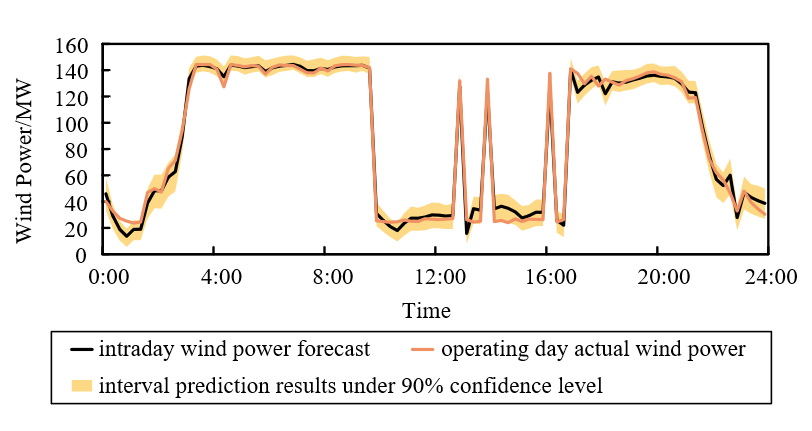

**ABSTRACT**:The significant uncertainty of wind power output severely hinders the accurate execution of electric market reporting plans, and the resulting power deviations may lead wind farms equipped with storage systems to incur high deviation penalties and wind curtailment losses. To mitigate the economic losses caused by incorrect bidding decisions, a multi-time scale market bidding model for wind farms is developed. Based on the existing market mechanisms in the United States, benefit and cost models for wind farms participating in the energy market and frequency regulation market are established. To improve the accuracy of bidding strategies, a quantitative model for wind power output uncertainty is developed using the Copula function, reserving part of the storage output capacity to reduce economic risks caused by power deviations. Aiming to maximize the expected net income of wind farms, day-ahead bidding strategies for the energy market and frequency regulation market are formulated, with bidding decisions adjusted based on ultra-short-term wind power forecast data in the intra-day stage. <u>A multi-time scale market participation strategy for wind farms equipped with energy storage is proposed, considering the uncertainty of wind power output.</u> Using a real-world wind farm in China as a case study, the results demonstrate that the proposed strategy can effectively enhance the economic benefits of wind farms while avoiding resource waste.

**Key Step 1: Model the uncertainty of wind power output with Copula Functions**

Based on the Copula function, we developed a wind power uncertainty model. The specific steps are as follows:

  

    
    
The formulation process of the wind power uncertainty model

  

The prediction accuracy of the static Copula function is relatively low, but it can obtain the wind power uncertainty interval for all time periods of the next day in one step. The dynamic Copula function offers higher prediction accuracy, but it can only model the wind power uncertainty for period *l+1* based on the actual wind power output of period *l*, making it impossible to determine the uncertainty intervals for the remaining periods. Therefore, this paper uses the static Gaussian Copula function combined with day-ahead wind power forecast data for the day-ahead bidding strategy, while employing the dynamic Copula function together with ultra-short-term wind power forecast data for the intraday bidding strategy.

  

    
    
Interval prediction results based on day-ahead wind power forecast data

  

  

    
    
Interval prediction results based on intraday wind power forecast data

  

**Key Step 2: Establish market bidding model for wind farm equipped with Storage**

Referring to the PJM market rules in the United States, we developed a revenue and cost model for wind farm (equipped with energy storage). The specific functions are provided in Equations (1) to (6) in this paper. 
Additionally, the time framework for market bidding is illustrated in the figure below.

  

    
    
Time frame of day-ahead energy market

  

  

  

    
    
Time frame of frequency regulation market

  

  
**Key Step 3: Multi-time scale market participation strategy**

  

    
    
Flowchart of multi-time scale bidding strategy

  

