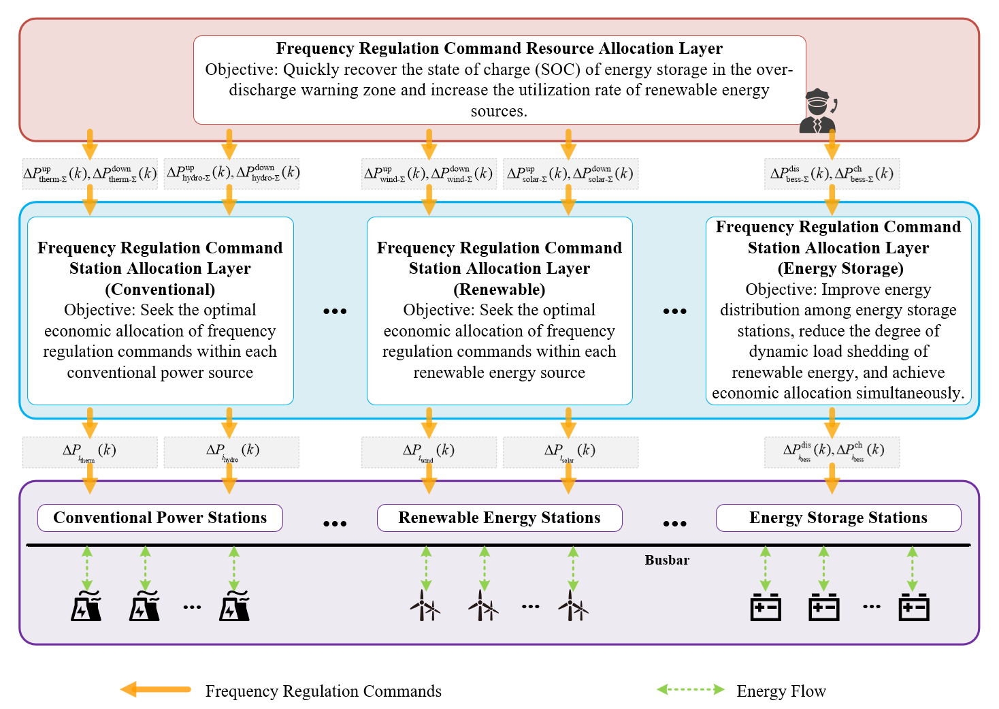
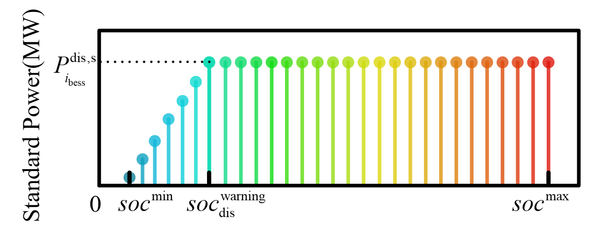
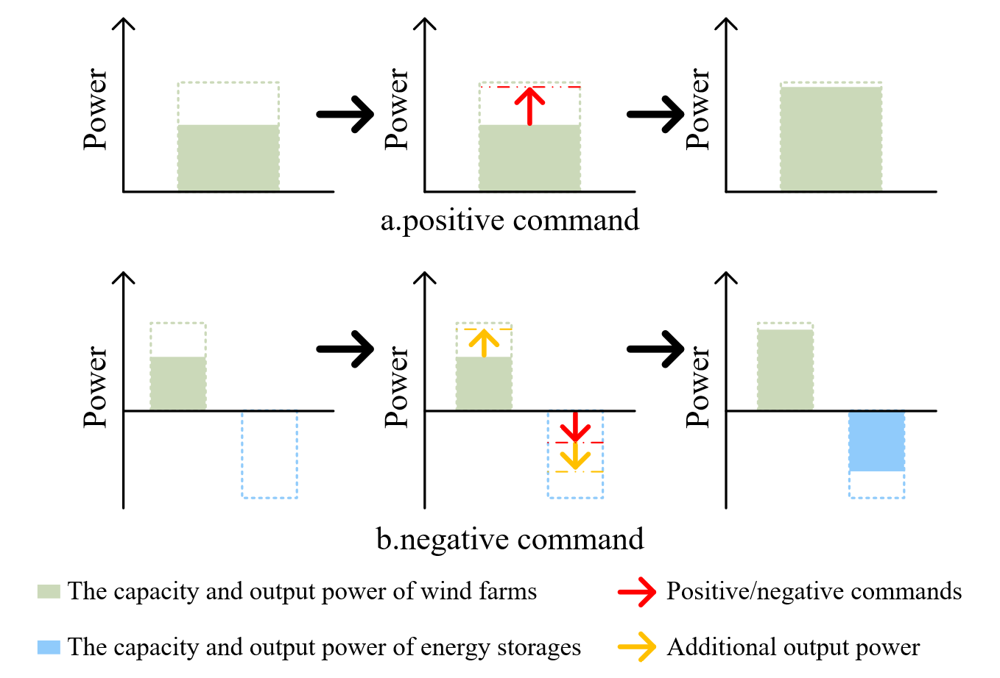

**ABSTRACT**: Excessive discharge of energy storage stations accelerates their energy depletion, which not only diminishes the frequency regulation capability of the energy storage resources and the overall system but also exacerbates the frequency regulation burden on other resources. To ensure the secure and stable operation of the power system and the high proportion consumption of new energy sources, <u>a two-layer distribution model for secondary frequency regulation commands has been established, involving the coordinated participation of multiple types and heterogeneous resources.</u> Firstly, an analysis of the characteristics of multi-type heterogeneous resources participating in system frequency regulation was conducted, and a mechanism for invoking frequency regulation resources that considers dynamic load reduction of new energy sources has been formulated. Subsequently, based on this mechanism, a two-layer distribution model for frequency regulation commands has been developed, which takes into account the state of charge recovery and adjustment. In the upper-layer model, a flexible allocation strategy for frequency regulation commands has been designed, involving the coordinated participation of new energy sources and energy storage, significantly enhancing the recovery speed of the charged state of energy storage stations. In the lower-layer model, considering the differences in the state of charge among energy storage stations, adjustment coefficients have been introduced, effectively improving the energy distribution within the energy storage resources. Finally, a case study analysis was conducted using a typical regional power system as an example. The results demonstrate that the proposed model effectively enhances the sustainability of frequency regulation provided by energy storage resources, thereby improving the system's frequency regulation capability and ensuring the high proportion consumption of new energy sources.

**Block diagram of two-layer distribution modal**

Upper layer: 
①Distribute commands among different generation clusters
②Propose a flexible allocation strategy designed to enhances the recovery speed of SOC

Lower layer: 
①Distribute commands within the same generation clusters(such as energy storage plants cluster)
②Take into account the available capacity and economic efficiency of the energy storage plantsTake into account the available capacity and economic efficiency of the energy storage plants

  

    
    
Block diagram of two-layer distribution modal

  

**Flexible Allocation Strategy on Upper layer**

The standard power of the energy storage system will be limited to prevent overuse when the SOC is relatively low, which means we need to quickly recover the SOC.

  

    
    
curve of standard discharging power

  

When the SOC is relatively low：
①If command is positive, the wind farms will undertake command to increase the proportion of wind power utilized.
②If the command is negative, the energy storage plants will undertake the command to charge in order to recover the SOC. Additionally, the wind farm output and energy storage charging power will be increased simultaneously.

  

    
    
key point of flexible allocation strategy

  

